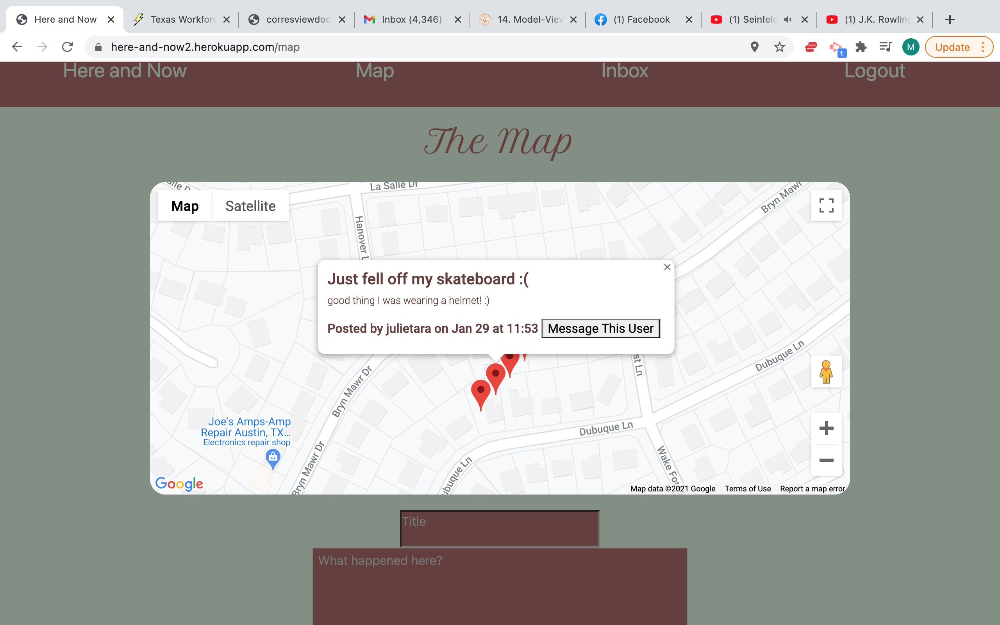

# Here and Now

## Description

This website allows users to post markers on their location. Other users can see these posts and message the poster should they choose.
<https://here-and-now2.herokuapp.com/>

## Table of Contents

- [Technologies](#technologies) 
- [Usage](#usage) 
- [Questions](#questions)

## Technologies

This website uses Node.js, express, handlebars, sequelize, bootstrap, dotenv, crypto, and bcrypt.

## Usage

Simply sign up and post something from your location on the maps page. You can also click on any visible markers and message the users who posted them.

## Questions

If you have any questions, contact me at <maxhealy01@gmail.com>.

You can also check out my github profile at [Github](https://github.com/maxhealy01)
